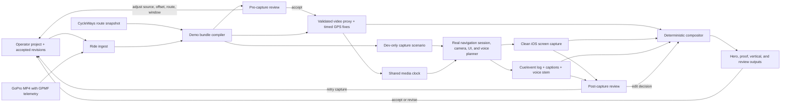

# CycleWays navigation demo studio — design

Date: 2026-07-23

Status: implemented continuous-proof studio; website-first multi-clip and reversible-workspace revision implemented 2026-07-23

## Executive decision

Build a local, deterministic **CycleWays Demo Studio** that turns a real GoPro
ride into a repeatable replay of the real iOS navigation experience.

The GoPro video is the master clock. GPS telemetry embedded in that video is
extracted into timestamped location fixes, validated against a chosen CycleWays
route, and fed through the app's existing development-only location-source
injection. The replay uses the real navigation session, camera, map, maneuver
presentation, and voice planner. The iOS screen, spoken guidance, cue events,
and ride footage are captured as separate synchronized stems and composed
offline into several deliverables.

The flagship film should not be a literal 50/50 screen recording. A 16:9 frame
works better with the landscape GoPro image at roughly 68% width and a large,
clean portrait app panel at roughly 32%. At important maneuvers, the app can
briefly grow while the road view stays visible. A second, uncut split-screen
version should prove that the synchronization is real rather than
hand-animated.

The defining promise is:

> Real road. Real recorded GPS. Real CycleWays navigation. Replayed without
> staging another ride.

The operator experience is **website first**. `npm run demo:studio` starts one
local, token-protected production workspace where the operator creates or
resumes projects, imports footage, runs diagnostics and validation, controls
Simulator capture, reviews sync, renders, restores revisions, and publishes.
The CLI remains a supported client of the same project model for automation and
troubleshooting; it is not a second workflow. The operator should not need to
remember commands, keep multiple terminals coordinated, or edit JSON by hand.

## 2026-07-23 product decision: one durable production workspace

Three requirements are now part of the core contract rather than later polish:

1. **A ride may contain multiple GoPro files.** The Studio models them as an
   ordered virtual ride timeline. Each clip retains its own media time, GPS
   extraction, trim, digest, and offset. Global GPS/navigation time is
   continuous across clip boundaries. Showcase selections may cross a boundary;
   the renderer splits such a selection at the seam and reads each half from
   the correct source file. The final edit uses a visible/audio transition at
   discontinuities rather than implying that unrelated footage was continuous.
2. **The website owns the complete operator journey.** A project dashboard
   presents Footage → Route & map → Showcases → App capture → Final edit →
   Publish. Long operations run as durable local jobs with live logs,
   cancellation, and retry. The browser may close without stopping a job.
   Restarting the Studio reconnects to a live detached job or marks a vanished
   process interrupted and retryable.
3. **Every Studio decision is reversible.** Each successful mutation writes a
   full revision snapshot as well as the append-only history event. Restoring
   revision N creates a new current revision; it never rewinds or deletes
   history. Attempts and published files are immutable. Before a destructive-
   looking edit, the UI explains which derived stages become stale and which
   expensive artifacts remain reusable.
4. **GPS quality is a timeline property, not an all-or-nothing import gate.**
   Inspection first uses the normal auditable cleanup pass. If one isolated
   outlier would otherwise poison the entire clip, it recovers the largest
   internally coherent run and records that recovery. Leading, trailing, and
   sustained GPS-unavailable intervals remain visible as striped exclusion
   zones. Validation also creates route-mismatch exclusions when coherent
   telemetry is geographically incompatible with the selected route. The
   operator may watch all footage, but cannot save a showcase that overlaps
   either exclusion type; the local service enforces the same rule.

“Resume” has precise semantics. Inspection and validation can be rerun from
durable inputs. Capture is atomic from the operator's perspective: an
interrupted Simulator recording becomes a retained failed/interrupted attempt
and retry creates a new attempt. A completed capture review offers **Capture
another take** independently of Accept and Reject; the previous attempt remains
immutable and the new attempt records it as its predecessor. Rendering may be
retried from the accepted capture and saved edit decision. The Studio never
claims it can append to a partially encoded capture safely.

Starting app capture also owns its local development prerequisites: it selects
an already booted Simulator or boots the configured device, starts Metro on
localhost when it is absent, verifies the CycleWays development app, and runs
the normal iOS development build/install when necessary. These operations are
part of the same persistent capture job and log; manual Simulator/Metro setup
is a troubleshooting escape hatch, not the happy path.

Source-code and map-data edits remain Git's responsibility. The Studio records
the Git commit plus a relevant working-tree fingerprint in each compiled
bundle. Revalidating after an app/map change therefore makes the previous
capture stale and requires a new capture, while retaining footage inspection,
showcases, and the prior accepted film.

## Why this is the right design

There are three separate problems hidden inside “record the Simulator while a
ride video plays”:

1. the route, video, GPS, app state, and voice must share one stable timeline;
2. the capture must be clean and reproducible enough for an investor film;
3. the result must remain an honest demonstration of the product, not a map
   animation that happens to resemble it.

The repository already solves much of the hard product logic:

- `scripts/video/concat.sh` extracts GoPro `gpmd` telemetry with `exiftool`,
  keeps it aligned to trimmed/concatenated footage, removes no-lock samples,
  and rejects teleport outliers.
- `packages/core/src/navigation/scenarios/` holds deterministic route and ride
  fixtures consumed by both headless and visual runners.
- `apps/mobile/src/navigation/journeyPlaybackSource.js` is an injectable
  location source for the real app session on Simulator or phone.
- `packages/core/src/navigation/scenarioRunner.js` produces a user-visible
  timeline including banners, maneuver state, haptics, and planned voice text.
- `apps/mobile/src/navigation/speechAdapter.js` speaks the actual navigation
  utterances through the iOS speech stack.
- Camera journeys and bookmarks already support quick state reconstruction and
  a real-time visible window around an important moment.
- Route data, routing shards, featured-route snapshots, and navigation logic
  are bundled in the native app. The current native basemap itself is still
  `Mapbox.StyleURL.Outdoors`, so “no new outdoor ride” is already attainable;
  “no network at capture time” needs either a prewarmed Mapbox cache or a
  separately designed offline basemap profile.

The studio should extend those seams instead of driving Simulator location with
`simctl`, automating taps across the whole UI, or rebuilding the navigation
screen in a video tool.

## Product outcomes

The studio should make it inexpensive to produce a new polished demonstration
whenever the app or route data improves. One imported ride should yield:

- a **60–90 second hero film** for investors, the website, and presentations;
- a **2–4 minute uncut proof film** with continuous road/app synchronization;
- a **30 second vertical cut** for social sharing;
- Hebrew and English-captioned variants from the same event data;
- a local review player and validation report showing why the take is safe to
  publish;
- reusable app, voice, ambience, caption, and event stems for later edits.

Success means a viewer understands, without explanation, that CycleWays knows
where the rider is, frames the road ahead, gives useful cycling-specific
guidance, and stays coherent as the physical ride unfolds.

## Non-goals

- This is not a public “watch a simulated ride” feature inside the shipping
  app.
- It does not replace physical-device navigation tests. GPS hardware,
  background execution, lock-screen behavior, and real road judgment still
  require field validation.
- It does not synthesize a prettier route than the one the app would actually
  navigate.
- It does not silently snap raw recorded positions onto the route to hide poor
  GPS or route-data mismatches.
- It does not claim fully offline map rendering while the native map uses the
  hosted Mapbox Outdoors style.
- It does not require the final film to be rendered in real time. Separate
  capture and deterministic post-production are intentional.

## Studio operator experience

### The operator's mental model: one project, many revisions

The person using the studio should think in terms of a **demo project**, not a
collection of scripts and temporary files. A project has:

- one or more private source videos;
- one selected route snapshot;
- a cleaned but auditable GPS track;
- named proof and editorial windows;
- zero or more capture attempts;
- zero or more edit decisions and renders;
- one explicitly accepted capture/render for each deliverable;
- a status that says what is ready, stale, blocked, or waiting for review.

Import, capture, and render attempts are immutable. Retrying creates a new run;
it never overwrites the previous result. The project records which attempt the
operator currently accepts, so a bad retry cannot destroy a known-good film.

Every derived artifact records its input digests. If the operator changes the
route or GPS offset, the studio marks navigation validation, app capture, and
renders stale. If only a title or caption changes, the expensive app capture
remains valid and only the affected render becomes stale. This dependency-aware
invalidation is central to a humane iteration loop.

### Website and CLI principles

The website is the normal production surface. It calls a bounded local service
which writes the same project actions and starts the same pipeline stages used
by the CLI. The CLI remains reliable and scriptable and should feel like a
guided production assistant rather than a bag of low-level commands.

The supported automation/debug surface is:

```text
demo:studio new <name>                 create a project with a guided prompt
demo:studio doctor                     check tools, disk, Simulator, voice, map
demo:studio status                     show readiness/staleness and the next step
demo:studio inspect                    inspect sources and GPS coverage
demo:studio configure <field>          preview and save a validated edit
demo:studio route set <slug>           choose, never silently guess, a route
demo:studio review                     open the local visual review workspace
demo:studio validate                   run data + navigation gates
demo:studio capture proof              create a new immutable capture attempt
demo:studio render proof               create a new immutable render attempt
demo:studio accept <artifact-or-run>    select the approved attempt
demo:studio reject <artifact-or-run>    retain but reject an attempt with notes
demo:studio history                    explain revisions and invalidations
demo:studio publish proof              export only an accepted passing render
demo:studio make proof                 run all safe cached stages, stopping for decisions
```

Commands discover `project.json` from the current directory or accept an
explicit `--project`. Interactive prompts are used only on a TTY; every command
also supports deterministic non-interactive operation for automation.

Every command ends with the same compact structure:

```text
RESULT   Captured proof attempt capture-003 (failed review gate)
WHY      Map tiles were incomplete for 18 frames at 00:47
KEPT     capture-002 remains the accepted capture
NEXT     demo:studio review --run capture-003
         or: demo:studio capture proof --retry-from capture-002
```

Long operations show the current stage, elapsed time, and where the full log is
being written. `Ctrl-C` leaves the previous project state intact and records an
aborted attempt with a resumable next step. Errors use stable codes for tests
and automation, but lead with plain language for the operator.

### Two review checkpoints are part of v1

Some decisions cannot be made responsibly from terminal metrics. Therefore a
minimal local web review workspace is required before the first publishable
proof, not deferred until hero editing.

**Pre-capture review** shows:

- source video with the cleaned GPS position and selected route;
- one or more clearly numbered showcase ranges;
- per-showcase GPS continuity feedback;
- simple start/end-at-playhead actions; and
- an explicit “ready for capture” action.

Showcase selection supports one to six ordered, non-overlapping source ranges.
The app capture runs continuously from the first selected start through the last
selected end so navigation state remains truthful across skipped ride time. The
final renderer keeps only the selected ranges and adds a brief visible/audio
fade at every discontinuity; it must never imply that separated ranges were one
uninterrupted moment. Calibration and render-tuning controls remain internal or
advanced until an observed problem requires them.

**Post-capture review** shows:

- frame-synchronized road and app video;
- speech/caption/camera/navigation markers;
- sync-flash and end-drift measurements;
- quick audio/caption preview;
- accept/reject with notes;
- a clear indication of whether a proposed edit requires only rerendering or a
  new app capture.

The browser writes normal project decisions; it does not mutate video or bypass
validation. The CLI and web workspace show the same status and suggested next
action.

### Status and staleness must be visible

`status` presents a small dependency table rather than a raw artifact listing:

| Stage | Example state | Meaning |
| --- | --- | --- |
| Source | ready | Media and telemetry were inspected |
| Track | needs review | A 6.2 s GPS gap affects the chosen window |
| Route | ready | Explicit route snapshot and digest selected |
| Navigation | stale | GPS offset changed after validation |
| Capture | accepted | `capture-002` is approved and still current |
| Voice | ready | Selected voice stem matches accepted events |
| Proof render | stale | Caption text changed; capture remains reusable |
| Publish | blocked | Current render has not been accepted |

The studio distinguishes:

- **blocked:** a prerequisite or gate prevents progress;
- **needs review:** software cannot make the judgment safely;
- **ready:** inputs are current and the stage may run;
- **running:** an attempt is in progress;
- **failed/aborted:** the attempt ended, but earlier artifacts remain;
- **stale:** it succeeded against older inputs and must not be published;
- **accepted:** a human selected this current passing attempt.

### A full real-world iteration scenario

The intended experience is not a perfect happy path. A realistic project looks
like this:

1. The operator runs `new upper-galilee-proof`. The guided setup asks for the
   GoPro file, intended route, output language, and whether the exact start/end
   coordinates are safe to display. It creates the project and immediately
   runs `doctor`.
2. `doctor` finds `ffmpeg` and `exiftool`, but no booted Simulator and only
   14 GB free. It explains that inspection can proceed, capture cannot, and a
   4K intermediate may need more disk. It does not install or delete anything.
3. `inspect` finds GPMF GPS but only 88% coverage. The terminal gives the
   summary and suggests `review`. In the browser, missing GPS is concentrated
   near the first minute; the operator trims that portion and keeps a continuous
   three-minute section with a strong visible turn.
4. The chosen catalog route is close overall, but validation shows a sustained
   mismatch late in the window. The review workspace makes it obvious that the
   current route snapshot uses a newer path. The operator chooses a different
   source window instead of snapping the recorded GPS or hiding the mismatch.
5. A recognizable bridge shows GPS is consistently 1.3 seconds behind the
   picture. The operator adjusts the one allowed global offset. The project
   records the old and new values, invalidates the normalized track and
   downstream artifacts, then recompiles only those stages.
6. Headless validation passes but warns that the proof begins too close to a
   voice cue. The operator drags the in-point eight seconds earlier. This changes
   the window and capture plan, not the GPS extraction or route snapshot.
7. The first Simulator capture fails because several Mapbox tiles remain blank.
   The run is preserved as `capture-001`, the error links to exact frames, and
   the tool recommends warming the area and retrying. No successful artifact is
   deleted.
8. `capture-002` succeeds. Post-capture review shows the app and road remain in
   sync, but the clean exported voice sounds different from the live iOS voice.
   The operator changes voice configuration and regenerates only voice/captions;
   the app video remains usable unless the voice timing contract changes.
9. The first proof render is technically correct, but the app panel feels too
   small on a conference-room screen. The operator changes the layout from
   68/32 to 62/38 and moves captions. `status` shows only the proof render is
   stale; rerendering takes minutes, not another real-time app capture.
10. An English caption is awkward. The operator edits the reviewed translation
    in the review workspace and rerenders. The Hebrew app UI and voice stem are
    untouched.
11. A newer app commit appears before publishing. `status` shows the accepted
    capture's app-commit mismatch. The operator may deliberately publish the
    previously accepted, fully attested build or recapture against the new
    commit; the tool never silently treats it as current.
12. The operator accepts `render-004` and runs `publish proof`. The studio
    rechecks gates, privacy, metadata stripping, source/capture/edit digests,
    and disclosure text, then exports the named deliverable and its shareable
    redacted report. All earlier attempts remain available for comparison.

This scenario defines the product bar for the studio itself: iteration should
be safe, understandable, and proportional to what changed.

## Recommended film concept: “The road and the guide”

### Visual hierarchy

Use a 3840×2160, 30 fps master timeline even when the first delivery is 1080p.
The GoPro source is full-height on the left. The real portrait app capture is
full-height or nearly full-height on the right, placed on a quiet dark or warm
off-white field rather than inside an oversized photorealistic phone mockup.
A subtle device silhouette is enough to explain that it is an iPhone.

Default framing:

| Element | Share of frame | Purpose |
| --- | ---: | --- |
| GoPro road view | 66–70% | Emotion, place, and physical proof |
| App capture | 28–34% | Product behavior at a legible scale |
| Divider / breathing room | 1–2% | Prevents the two moving views from fighting |

A strict 50/50 split makes a portrait screen either too short or surrounded by
dead space, while unnecessarily shrinking the best visual asset: the ride.

At a high-value maneuver, animate over 300–500 ms to a roughly 58/42 split,
hold until the turn is complete, and return. Use this sparingly. The map camera
and road view already create enough motion.

### On-screen language

The app remains exactly as captured. For a Hebrew customer cut, add only
accessibility captions for spoken guidance. For an international investor cut,
show a single-line English translation below the actual Hebrew prompt, using
the deterministic voice-event stream. Do not replace or cover the Hebrew app
UI with invented English UI.

An opening proof label can appear for two seconds:

> App replay driven by GPS embedded in this recorded ride

An end-card footnote can say:

> Navigation UI and guidance captured from the CycleWays iOS app. Ride replayed
> from recorded GPS; edit points are marked by scene transitions.

That line turns simulation into evidence instead of a credibility concern.

### Audio hierarchy

Spoken guidance is the lead. Keep recognizable road ambience underneath it so
the video does not feel sterile. Wind-heavy GoPro audio should be filtered and
lowered; optional music should duck around every instruction.

Recommended mix targets:

- navigation voice centered and clearly intelligible;
- road ambience 12–18 dB below the voice while it speaks;
- music ducked a further 4–7 dB around guidance;
- final program around −16 to −14 LUFS integrated, with peaks at or below
  −1 dBTP;
- every spoken instruction captioned.

Do not add a narrator over active turn guidance. If narration is needed, put it
between guidance moments.

## Three deliverables from one truth source

### 1. Hero film

A short editorial story, not a complete ride. It uses a handful of real-time
windows taken from one or more validated continuous replay sessions.

Suggested 75-second structure:

| Time | Road view | App view | Message |
| --- | --- | --- | --- |
| 0–5 s | Entering a visually clear turn | Live maneuver and moving map | Immediate proof; start with the payoff |
| 5–10 s | Wide scenic continuation | CycleWays mark / route identity | “Cycling routes become confident rides” |
| 10–20 s | Calm lead-in | Discover or route detail, then route overview | A curated route, not a generic car map |
| 20–28 s | Rolling toward the route | Real Ride Intro and Start | The app understands where the rider begins |
| 28–48 s | Continuous approach and turn | Follow camera, distance countdown, voice | The core navigation experience |
| 48–62 s | A distinctive junction, crossing, named path, or roundabout | Cycling-specific cue and current-way context | Local knowledge becomes useful guidance |
| 62–70 s | Strong scenic finish | Progress and arrival | The ride resolves cleanly |
| 70–75 s | Hero frame | Logo and one CTA | Memorability |

Only include recovery/rejoin behavior if the road footage and recorded GPS
actually contain the matching deviation. A synthetic “wrong turn” can be a
separate, clearly labeled product-capability scene, but it should not be cut
into an apparently continuous real ride.

### 2. Uncut proof film

Show 2–4 minutes of uninterrupted footage and app navigation with a fixed split
and no speed ramp. This is less cinematic and more persuasive in a meeting:
the puck, map rotation, cue countdown, physical junction, and spoken instruction
remain mutually consistent over time.

The title slate should identify the route and say that the replay uses embedded
GPS. A small optional timecode can make synchronization inspectable. Remove it
from the hero film.

### 3. Vertical short

Use the GoPro video full-frame in 9:16 and place a cropped, still-legible app
panel in the lower 40–45%, separated by a soft gradient. Focus on one maneuver,
one prompt, and one payoff. Trying to retell the entire discovery-to-arrival
story in 30 seconds will make both views unreadable.

## A creative meeting alternative: the live replay desk

The same demo bundle can power a local review/player experience for in-person
meetings. A presenter scrubs the ride video and chooses named beats such as
“first turn”, “roundabout”, “off route”, or “arrival”. The app pane jumps to a
pre-rendered synchronized app capture, or a paused/reconstructed live Simulator
state using the existing camera bookmarks.

This is more compelling than asking an investor to watch a long linear video,
but it should be an additive second surface. The rendered hero and proof films
remain the reliable, portable deliverables.

## System architecture



The final pixels are composited after capture. The GoPro player and Simulator
do not need to be visible in one desktop recording, and a dropped frame in one
source does not ruin every other stem.

## The demo bundle

Every ride becomes an immutable, locally generated bundle. Raw personal media
should normally remain outside version control; the manifest stores relative
workspace paths or content hashes rather than publishing the original file.

Conceptual layout:

```text
demo-work/<demo-id>/
  project.json                    # operator choices + stage status
  history.jsonl                   # append-only decisions and invalidations
  source/
    ride-proxy.mov
    ride-audio.wav
    gps.raw.csv
    gps.cleaned.json
  route/
    route-state.js
    route-report.json
  captures/
    capture-001/                  # failed/aborted attempts remain inspectable
    capture-002/
      app-clean.mov
      navigation-events.json
      review.json
  decisions/
    proof-window-v3.json
    proof-edit-v4.json
    translations-v2.json
  renders/
    render-001/
    render-004/
      voice.wav
      voice.he.srt
      voice.en.srt
  output/
    cycleways-hero-4k.mp4
    cycleways-proof-1080p.mp4
    cycleways-vertical.mp4
    validation-report.html
```

This proposed location is illustrative, not a decision to check generated
media into the repository.

### Project and manifest model

`project.json` is written by `new`, CLI configuration commands, and the local
review workspace. It contains operator intent plus pointers to accepted
immutable attempts. `history.jsonl` records every decision and invalidation.
Large derived facts stay in their own artifacts and are referenced by digest;
the project file does not become a giant mutable cache.

```jsonc
{
  "schemaVersion": 1,
  "id": "sovev-beit-hillel-summer",
  "source": {
    "video": "/path/to/original/GX010123.MP4",
    "sha256": "...",
    "trim": { "in": 12.4, "out": 928.0 },
    "gpsOffsetSeconds": 0.0
  },
  "route": {
    "kind": "catalog-snapshot",
    "slug": "sovev-beit-hillel",
    "snapshotDigest": "..."
  },
  "capture": {
    "device": "iPhone 16 Pro",
    "runtime": "pinned iOS Simulator runtime",
    "locale": "he-IL",
    "appearance": "light",
    "mapProfile": "mapbox-outdoors-prewarmed",
    "voice": { "language": "he-IL", "rate": 0.92 }
  },
  "story": {
    "title": "Ride the Upper Galilee with confidence",
    "beats": [
      { "id": "hook-turn", "at": 214.2, "preRoll": 8, "postRoll": 7 },
      { "id": "named-path", "at": 391.5, "preRoll": 6, "postRoll": 8 },
      { "id": "arrival", "at": 916.0, "preRoll": 10, "postRoll": 4 }
    ]
  }
}
```

The real schema should allow either a single MP4 or the existing `list.txt`
trim/concatenate workflow. A compiled bundle records the Git commit, route-data
digest, app build, Simulator model/runtime, locale, source hashes, and tool
versions. That makes a successful take reproducible months later.

Changing the project produces a new revision with an explicit reason. The
studio calculates which artifacts remain reusable. It never asks the operator
to manually delete a cache or determine whether an old capture is still valid.

## Ride ingest

### Telemetry extraction

Keep the current `ffmpeg`/`ffprobe`/`exiftool` path as the first adapter because
it is already present and proven in this repository. Detect the actual GoPro
metadata stream rather than assuming a fixed `0:d:1` index for every camera.
Extract, where available:

- sample time relative to media presentation time;
- fix mode / validity;
- latitude and longitude;
- altitude;
- 2D ground speed;
- GPS precision or dilution value;
- GPS timestamp for diagnostics, not for the edit clock.

GoPro's GPMF format stores telemetry in a time-indexed MP4 metadata track; newer
streams may expose `GPS9` while earlier cameras use `GPS5`. The importer should
be stream-aware and retain the original extracted rows for auditing.

### Normalization

Compile every accepted row to the app's navigation-fix shape:

```js
{
  lat,
  lng,
  altitude,
  speed,
  heading,
  accuracy,
  timestamp // integer milliseconds on the media timeline
}
```

Heading can be derived from successive valid moving fixes when telemetry does
not expose a reliable course. Do not derive heading while stopped. If no usable
precision field exists, use a documented conservative accuracy default rather
than pretending to know sensor accuracy.

Retain two tracks:

- **raw valid fixes**, after removing only samples without a GPS lock;
- **capture fixes**, after documented teleport rejection, timestamp cleanup,
  and any bounded short-gap interpolation.

Never route-snap capture fixes. Snapping would make the replay look better while
removing exactly the GPS noise the app is meant to handle.

### Gaps and cuts

- A gap of a few seconds may be linearly interpolated only when both endpoints
  are plausible and the action is continuous; the report must disclose it.
- A longer gap should cause the corresponding shot to be rejected or cut away.
- Non-contiguous source clips must not be treated as one continuous navigation
  session. Each visible window should reconstruct state from its own earlier
  fixes, then enter real time at the edit in-point.
- Speeding an entire ride up 5× is useful for a route-summary video but usually
  harms a navigation demo: guidance crowds together and viewers cannot compare
  a maneuver with the road. Prefer real-time windows joined by explicit scene
  transitions or an animated route-progress interlude.

## Route selection and truth checks

The operator chooses a catalog route, shared-route token, or explicit route
snapshot. The studio does not guess and silently publish a route.

The compiler projects GPS against the selected navigation geometry and reports:

- median and 95th-percentile lateral distance;
- start/end distance from the chosen route and expected progress direction;
- duration and percentage of samples with valid GPS;
- timestamp gaps and teleport drops;
- sustained excursions that the real session is expected to call off-route;
- route coverage and whether arrival is reachable in the clip;
- cue count and important cue types present in the selected windows.

Useful default gates for an on-route proof take are:

- at least 95% valid GPS coverage over visible footage;
- median route distance no more than about 12 m;
- 95th percentile no more than about 30 m;
- no unplanned sustained excursion that triggers the actual session's
  off-route state;
- no unexplained timestamp reversal or video/GPS duration mismatch;
- at least one legible maneuver and one spoken instruction in the hero window.

These are screening defaults, not a new navigation product contract. The final
authority is the headless replay through the real session.

If the source and current route snapshot disagree, the safe choices are to pick
the historically correct route snapshot, fix the underlying route data, choose
a different ride, or explicitly label the ride as off-route. Do not repair the
evidence only inside the demo.

### Validation scopes

Validation must distinguish the source from the material that will actually be
captured and shown:

- **full source diagnostics** inspect the entire cleaned GoPro track and remain
  visible in the CLI and review workspace, but do not block the demo when an
  issue is wholly outside the selected edit;
- **capture-envelope gates** cover first showcase in-point minus pre-roll
  through the final showcase out-point. Route fit, GPS gaps, forbidden
  navigation state, and off-route state are blocking here because the app runs
  continuously across the envelope, including the discarded intervals between
  showcases;
- **final-edit gates** cover only the selected showcase ranges. Requirements
  such as spoken guidance must be satisfied by footage that survives the edit,
  not by an event in pre-roll or a discarded middle section.

The headless navigation engine still replays the complete track so the capture
envelope begins with truthful warmed state. Scoping changes which events count
as publish-blocking evidence; it does not reset or simplify navigation. The
review map renders the complete source track muted and the capture envelope in
the active color, with a plain-language note for non-blocking source findings.

## Reuse the real navigation harness

### Scenario adapter

The compiled ride should be exposed through the same resolved shape as current
navigation scenarios: a navigation route, fixes, connector behavior,
expectations, optional bookmarks, and a description. It can live in a generated
demo-only registry or be loaded by a development capture build; it must stay
out of release bundles just like the current scenario harness.

The initial version should drive the app through its injected `locationSource`,
not through Simulator's OS location controls. This has four advantages:

- the exact same fixes are available to headless validation and visual capture;
- permission dialogs and OS GPS throttling cannot alter a take;
- it already works on Simulator and a dev build on a physical phone;
- it exercises the actual CycleWays navigation session rather than a parallel
  demo state machine.

### Capture entry mode

Add a development-only **capture mode** conceptually separate from SIM/CAM test
controls. It should:

- launch directly into a chosen compiled demo bundle;
- optionally show the real Discover → Detail → Ride Intro flow before replay;
- hide SIM, CAM, REC, diagnostics, bookmark controls, and development badges;
- preserve all production navigation UI, map, camera, and voice behavior;
- wait on an explicit `armed` state so recording can start before time zero;
- emit a one-frame visual sync marker and an event marker at start;
- use fixed locale, appearance, text size, clock, permissions, and orientation;
- log actual cue, banner, voice, camera-stage, and session events on media time;
- hold the final frame rather than abruptly returning to the planner.

This is a clean-capture shell around the real app, not a custom demo screen.

## Synchronization model

### The video presentation timestamp is the only master clock

Do not use GPS UTC, wall-clock time, chained `setTimeout` intervals, or the
screen recorder's elapsed time as independent authorities. Normalize all
location samples and event markers onto the source video's presentation
timeline:

```text
mediaTime = sourceSampleTime - trimIn + configuredFineOffset
```

The current journey source schedules each next fix after the previous callback.
That is excellent for developer playback, but callback/render cost can
accumulate drift over a long capture. Capture mode should instead anchor to one
monotonic start instant:

```text
dueWallTime(fix) = captureMonotonicStart + fix.mediaTime
```

At each scheduler tick, emit every fix whose due time has passed. Do not add the
previous callback's work to the next delay. Record actual dispatch lateness in
the validation log.

### Warm-up and scene windows

For an uncut proof, begin from the first relevant GPS sample and run at 1×.

For an editorial beat at minute 12, do not make the operator wait 12 minutes or
start a blank session at that point. Reuse the camera-bookmark model:

1. replay all earlier fixes without rendering at high speed to reconstruct the
   real session, voice memory, progress, and connector state;
2. stop before the visible in-point;
3. give the map/camera a short hidden pre-roll;
4. enter real-time, media-clocked playback for the captured window;
5. hold or cleanly end after the post-roll.

Voice events from the warm-up must be marked suppressed so they never leak into
the captured stem.

### Sync verification

Generate a start marker in the app event log and a one-frame colored flash in
the app capture. The compositor aligns that marker to media time zero. An end
marker detects drift.

Separate two kinds of error:

- **capture-clock error:** app video versus master video; target no more than
  two output frames at the beginning and end of a take;
- **sensor/content error:** GoPro GPS lag or noise relative to visible road;
  inspect at recognizable junctions and record any fine offset in the manifest.

The operator may adjust one constant GPS/video offset after inspecting a known
landmark. Per-turn hand offsets are forbidden: they would conceal telemetry or
route problems.

## Voice, captions, and audio capture

Treat spoken guidance as a first-class deterministic stem, not whatever happens
to be audible in a desktop screen recording.

The app replay should log every actual utterance request with its media time,
text, language, rate, priority, and interruption behavior. Then support two
voice paths:

1. **actual-device proof path:** record the physical iPhone screen with sound;
2. **clean master path:** render the logged utterances through
   `AVSpeechSynthesizer` using the same language/voice settings and write its
   audio buffers to a file, then place each utterance at its real event time.

Apple exposes an `AVSpeechSynthesizer` buffer-writing API specifically for
storing synthesized speech. This provides a clean voice stem while keeping the
content and voice technology aligned with the app. The actual-device pass
guards against configuration differences between exported and live speech.

Create subtitles directly from the utterance log. Hebrew captions use the
spoken text. English captions are reviewed translations keyed by stable
utterance/event IDs, not machine-translated anew on every render.

## Capture-path decision

| Path | Strengths | Weaknesses | Role |
| --- | --- | --- | --- |
| Simulator video via `xcrun simctl io … recordVideo` | Clean device pixels, scriptable, reproducible | Treat as video-only; separate audio stem required | **Default master** |
| Simulator window + macOS screen/system-audio capture | One-pass preview with live sound | Window crop, notifications, scaling, and desktop capture state add risk | Review and quick drafts |
| Physical iPhone built-in screen recording | Real hardware rendering and actual app sound; no ride needed because the internal source is injected | Manual start/transfer, recording indicators, less reproducible | **Credibility/QA proof pass** |
| OS-level Simulator GPS injection | Exercises Core Location boundary | Slow, harder to coordinate, route format/tooling variability, duplicates an existing injection seam | Not recommended for the film |
| Rebuilt phone UI in After Effects/HTML | Total art direction control | Not the product; high credibility and maintenance cost | Reject |

Apple documents both Simulator video capture through `simctl` and iPhone screen
recording with sound. Those are viable capture endpoints; neither should own
the synchronization model.

## Deterministic composition

Use `ffmpeg` as the final render authority. It is already part of the media
workflow, is scriptable, and makes exact rerenders possible. A small local web
review UI can author crop, beat, title, and caption choices, but it should emit
an edit-decision JSON consumed by the renderer.

The compositor should:

- normalize sources to the master frame rate and audio sample rate;
- align from explicit sync markers, never by eyeballing clip starts;
- crop or pad without distorting the app screen;
- place a restrained device frame/background and brand typography;
- animate only documented layout transitions;
- mix voice, ambience, and optional licensed music as separate inputs;
- burn or sidecar captions depending on delivery;
- strip source GPS and unrelated metadata from public outputs;
- retain a high-quality mezzanine master and create H.264/AAC delivery files
  with broad presentation compatibility.

Avoid baking speed, titles, or crops into the one source app capture. One clean
capture should be reusable across aspect ratios and language variants.

## Review workspace

A minimal review workspace is a v1 requirement because both GPS/video
calibration and capture acceptance are visual judgments. `demo:studio review`
starts a loopback server, opens the project in a browser, and lands on the first
unresolved decision. It never requires the operator to browse artifact folders.

Before capture, present:

- source video, route, raw/clean GPS, and route-distance plot on one playhead;
- the global GPS/video offset control with before/after landmark comparison;
- proof-window handles, GPS gaps, headless navigation cues, and voice markers;
- gate explanations with the affected time range and safe choices;
- an explicit “accept inputs for capture” action.

After capture, present:

- synchronized ride video and captured app video;
- play/pause, frame step, and timeline zoom;
- GPS position and route-distance diagnostics at the cursor;
- navigation events as labeled markers;
- voice/caption preview;
- warnings for gaps, off-route periods, dispatch lateness, missing map tiles,
  or unavailable speech;
- accept/reject/notes for capture and render attempts;
- an impact preview such as “caption-only: rerender required” or “GPS offset:
  validation and capture required”.

Later editorial expansion adds hero beat selection, layout animation, English
translation editing, and the meeting-oriented live replay desk. These grow from
the same project/revision model rather than creating a second workflow.

This is the best place for human judgment. A map can be technically aligned yet
the selected road shot may be visually unconvincing because foliage hides the
turn or the GoPro points away from the useful landmark.

## Quality and honesty gates

A render is publishable only when all applicable gates pass.

### Data gates

- Video, audio, and metadata stream durations are internally consistent.
- GPS timestamps are monotonic after documented cleanup.
- Invalid/no-lock samples and teleport drops are counted.
- The selected route snapshot digest is fixed in the bundle.
- Route-distance and gap thresholds pass or are explicitly waived in the
  report.

### Navigation gates

- Headless replay reaches every expected status and selected cue.
- No unexpected off-route, reroute, duplicate voice, or premature arrival
  occurs.
- The visual replay uses the same compiled fixes and route digest as headless
  validation.
- Each hero beat has enough pre-roll for the camera and cue state to be natural.
- Voice and visible instruction agree.

### Capture gates

- No development overlay, alert, permission prompt, loading spinner, blank
  Mapbox tile, touch indicator, or desktop notification is visible.
- Locale, font scale, appearance, and Simulator model match the manifest.
- Capture-clock start/end error is within tolerance.
- The app is captured at native aspect ratio and remains legible at target
  delivery size.

### Editorial gates

- Every cut in an apparently continuous scene preserves road/app chronology.
- Any synthetic capability scene is labeled as such.
- Captions are proofread and safe-area compliant.
- Music and imagery have publishable rights.
- Public output contains no GPS metadata or accidental private start/end
  information beyond the route intentionally shown.

### Studio usability gates

- A new operator can create, inspect, validate, capture, review, iterate, and
  publish without hand-editing project JSON.
- Interrupting or failing capture/render preserves prior accepted work and
  leaves an actionable next step.
- Every saved change previews and records its downstream impact.
- A caption/layout change rerenders without recapturing; a GPS/route change
  cannot accidentally reuse a stale capture.
- `status`, CLI command results, and the review workspace agree about what is
  current, stale, accepted, and blocked.
- Publishing requires explicit human acceptance of a current passing render.

## Privacy and source handling

GoPro GPS can reveal a home, school, or habitual start location. The studio
should default to private, gitignored workspaces and require an explicit publish
step. Show a map of every coordinate that will appear in the film, not just the
selected hero window, before export.

The public film may show a public curated route, but raw GPS sidecars should not
be bundled with it. Strip metadata from final MP4s and avoid checking large raw
camera files, personal paths, or unreviewed fixes into source control.

## Failure handling

| Failure | Safe response |
| --- | --- |
| Required tool, disk, voice, or Simulator is unavailable | `doctor` marks only the affected stages blocked and prints a concrete check/remedy; inspection and review remain usable where possible |
| No `gpmd`/GPS stream | Ask for a sidecar GPX/FIT/CSV, choose another source, or create a clearly labeled route-timeline simulation; do not infer a “real GPS” claim |
| GPS starts late or ends early | Trim the visible take to covered time or reject it |
| Route snapshot no longer matches the recorded ride | Use a deliberate historical snapshot or repair route data outside the demo workflow |
| Sustained GPS gap | Exclude that window; only bounded short interpolation is allowed and disclosed |
| App unexpectedly goes off-route | Treat it as a product/data finding, not an editing problem |
| Map tiles are blank offline | Prewarm under Mapbox terms for a capture machine, capture with network, or design a real offline basemap separately |
| Selected iOS voice is unavailable | Fail the clean voice render and require explicit voice selection; never silently substitute mid-project |
| Simulator capture drops frames | Recapture the app stem; do not time-stretch the road footage to hide it |
| Voice overlaps after an editorial cut | Extend pre/post-roll or cut between utterances; do not truncate spoken navigation mid-word |
| Capture/render is interrupted | Preserve the partial run as aborted with its logs, keep prior accepted attempts, and offer the smallest safe retry |
| A project input changes after capture | Mark only digest-dependent artifacts stale; explain why publication is blocked and what can still be reused |
| A retry is worse than the previous attempt | Keep both immutable attempts and leave the accepted pointer unchanged until the operator explicitly switches it |

## Alternatives considered

### Feed GPX directly to Simulator

Useful for testing the Core Location boundary, but not the best production
engine here. CycleWays already injects a location source directly into the real
session. Simulator GPS adds another clock, more permissions and automation,
and less control over warm-up/bookmarks without improving what the viewer sees.

### Record the GoPro player and Simulator side by side in one pass

Fast for a prototype, fragile for a polished film. Window placement, dropped
frames, audio routing, and start timing become baked together. Separate stems
make every problem independently recoverable.

### Use the existing sparse video-sync keyframes as navigation GPS

Those keyframes are excellent for a route-story map cursor, but they are
deliberately simplified and snapped to route progress. Navigation needs the
full cleaned sensor track so it encounters realistic noise, stops, and timing.

### Hand animate a phone mockup

It may look perfect, but it stops demonstrating CycleWays. The real app is
already visually rich enough; production effort is better spent on route
choice, capture cleanliness, pacing, captions, and sound.

### Make the whole ride a 5× timelapse

Works for a scenic route summary, not for navigation proof. Physical turns,
camera motion, countdowns, and speech become too compressed. Use real-time
proof windows and explicit transitions across skipped ride time.

## Recommended first demo

Start with **Sovev Beit Hillel** if a GPS-bearing GoPro source overlaps the
existing route. It already has a catalog route snapshot, a full real-route SIM
scenario, featured content, video-sync data, named cycling ways, and camera
journey coverage. That minimizes unknowns and lets the first film focus on the
tool and story rather than new route authoring.

Choose one or two continuous sections, totaling roughly 2–4 minutes, containing:

- an unmistakable junction or turn visible in the GoPro frame;
- at least ten seconds of calm lead-in;
- a spoken preview and final instruction;
- a named CycleWays segment or cycling-specific cue if available;
- clean GPS coverage and no unexplained route mismatch;
- attractive road scenery after the maneuver.

Capture the full first-to-last envelope so the app remains continuous, then use
explicit transitions between the selected sections in the proof. Once it
passes, use the same bundle for the hero hook and vertical cut. This sequence
establishes truth before polish.

## Repository fit and future work boundary

This design anticipates future code in four bounded areas, but authorizes none
in this planning change:

- a ride-ingest/demo-bundle compiler alongside the existing video scripts;
- generated demo-only scenario loading and media-clocked playback;
- a clean capture entry mode and event/voice logging in the mobile dev build;
- a minimal v1 review workspace plus deterministic renderer, later expanded
  into the editorial/live replay desk.

No demo media, scenario, or control should enter production bundles by default.
The existing Metro replacement of dev harness modules with
`apps/mobile/src/dev/emptyDevHarness.js` is the precedent to preserve.

A future implementation plan should define the project/revision model, file
layout, manifest schema, tests, capture automation, minimum review workspace,
and one thin vertical slice: create a project, diagnose it, ingest one short
GoPro clip, visually approve its route/offset/window, capture one continuous app
take, review it, iterate one edit without recapturing, and publish one proof
film. The full hero editor and live replay desk should follow only after that
slice is credible.

## Verified external platform facts

- Apple documents Simulator video recording with
  `xcrun simctl io booted recordVideo <file>` in its
  [Simulator guide](https://developer.apple.com/library/archive/documentation/IDEs/Conceptual/iOS_Simulator_Guide/InteractingwiththeiOSSimulator/InteractingwiththeiOSSimulator.html).
- Apple documents that iPhone screen recording can capture sound in
  [Record the screen on your iPhone](https://support.apple.com/en-us/102653).
- Apple documents writing synthesized utterances to audio buffers through
  [`AVSpeechSynthesizer.write`](https://developer.apple.com/documentation/avfaudio/avspeechsynthesizer/write%28_%3Atobuffercallback%3A%29).
- GoPro documents GPMF as time-indexed telemetry inside the MP4 metadata track,
  including GPS streams, in the official
  [GPMF parser repository](https://github.com/gopro/gpmf-parser).
