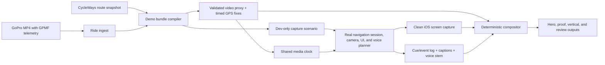

# CycleWays navigation demo studio — design

Date: 2026-07-22

Status: proposed design

## Executive decision

Build a local, deterministic **CycleWays Demo Studio** that turns a real GoPro
ride into a repeatable replay of the real iOS navigation experience.

The GoPro video is the master clock. GPS telemetry embedded in that video is
extracted into timestamped location fixes, validated against a chosen CycleWays
route, and fed through the app's existing development-only location-source
injection. The replay uses the real navigation session, camera, map, maneuver
presentation, and voice planner. The iOS screen, spoken guidance, cue events,
and ride footage are captured as separate synchronized stems and composed
offline into several deliverables.

The flagship film should not be a literal 50/50 screen recording. A 16:9 frame
works better with the landscape GoPro image at roughly 68% width and a large,
clean portrait app panel at roughly 32%. At important maneuvers, the app can
briefly grow while the road view stays visible. A second, uncut split-screen
version should prove that the synchronization is real rather than
hand-animated.

The defining promise is:

> Real road. Real recorded GPS. Real CycleWays navigation. Replayed without
> staging another ride.

## Why this is the right design

There are three separate problems hidden inside “record the Simulator while a
ride video plays”:

1. the route, video, GPS, app state, and voice must share one stable timeline;
2. the capture must be clean and reproducible enough for an investor film;
3. the result must remain an honest demonstration of the product, not a map
   animation that happens to resemble it.

The repository already solves much of the hard product logic:

- `scripts/video/concat.sh` extracts GoPro `gpmd` telemetry with `exiftool`,
  keeps it aligned to trimmed/concatenated footage, removes no-lock samples,
  and rejects teleport outliers.
- `packages/core/src/navigation/scenarios/` holds deterministic route and ride
  fixtures consumed by both headless and visual runners.
- `apps/mobile/src/navigation/journeyPlaybackSource.js` is an injectable
  location source for the real app session on Simulator or phone.
- `packages/core/src/navigation/scenarioRunner.js` produces a user-visible
  timeline including banners, maneuver state, haptics, and planned voice text.
- `apps/mobile/src/navigation/speechAdapter.js` speaks the actual navigation
  utterances through the iOS speech stack.
- Camera journeys and bookmarks already support quick state reconstruction and
  a real-time visible window around an important moment.
- Route data, routing shards, featured-route snapshots, and navigation logic
  are bundled in the native app. The current native basemap itself is still
  `Mapbox.StyleURL.Outdoors`, so “no new outdoor ride” is already attainable;
  “no network at capture time” needs either a prewarmed Mapbox cache or a
  separately designed offline basemap profile.

The studio should extend those seams instead of driving Simulator location with
`simctl`, automating taps across the whole UI, or rebuilding the navigation
screen in a video tool.

## Product outcomes

The studio should make it inexpensive to produce a new polished demonstration
whenever the app or route data improves. One imported ride should yield:

- a **60–90 second hero film** for investors, the website, and presentations;
- a **2–4 minute uncut proof film** with continuous road/app synchronization;
- a **30 second vertical cut** for social sharing;
- Hebrew and English-captioned variants from the same event data;
- a local review player and validation report showing why the take is safe to
  publish;
- reusable app, voice, ambience, caption, and event stems for later edits.

Success means a viewer understands, without explanation, that CycleWays knows
where the rider is, frames the road ahead, gives useful cycling-specific
guidance, and stays coherent as the physical ride unfolds.

## Non-goals

- This is not a public “watch a simulated ride” feature inside the shipping
  app.
- It does not replace physical-device navigation tests. GPS hardware,
  background execution, lock-screen behavior, and real road judgment still
  require field validation.
- It does not synthesize a prettier route than the one the app would actually
  navigate.
- It does not silently snap raw recorded positions onto the route to hide poor
  GPS or route-data mismatches.
- It does not claim fully offline map rendering while the native map uses the
  hosted Mapbox Outdoors style.
- It does not require the final film to be rendered in real time. Separate
  capture and deterministic post-production are intentional.

## Recommended film concept: “The road and the guide”

### Visual hierarchy

Use a 3840×2160, 30 fps master timeline even when the first delivery is 1080p.
The GoPro source is full-height on the left. The real portrait app capture is
full-height or nearly full-height on the right, placed on a quiet dark or warm
off-white field rather than inside an oversized photorealistic phone mockup.
A subtle device silhouette is enough to explain that it is an iPhone.

Default framing:

| Element | Share of frame | Purpose |
| --- | ---: | --- |
| GoPro road view | 66–70% | Emotion, place, and physical proof |
| App capture | 28–34% | Product behavior at a legible scale |
| Divider / breathing room | 1–2% | Prevents the two moving views from fighting |

A strict 50/50 split makes a portrait screen either too short or surrounded by
dead space, while unnecessarily shrinking the best visual asset: the ride.

At a high-value maneuver, animate over 300–500 ms to a roughly 58/42 split,
hold until the turn is complete, and return. Use this sparingly. The map camera
and road view already create enough motion.

### On-screen language

The app remains exactly as captured. For a Hebrew customer cut, add only
accessibility captions for spoken guidance. For an international investor cut,
show a single-line English translation below the actual Hebrew prompt, using
the deterministic voice-event stream. Do not replace or cover the Hebrew app
UI with invented English UI.

An opening proof label can appear for two seconds:

> App replay driven by GPS embedded in this recorded ride

An end-card footnote can say:

> Navigation UI and guidance captured from the CycleWays iOS app. Ride replayed
> from recorded GPS; edit points are marked by scene transitions.

That line turns simulation into evidence instead of a credibility concern.

### Audio hierarchy

Spoken guidance is the lead. Keep recognizable road ambience underneath it so
the video does not feel sterile. Wind-heavy GoPro audio should be filtered and
lowered; optional music should duck around every instruction.

Recommended mix targets:

- navigation voice centered and clearly intelligible;
- road ambience 12–18 dB below the voice while it speaks;
- music ducked a further 4–7 dB around guidance;
- final program around −16 to −14 LUFS integrated, with peaks at or below
  −1 dBTP;
- every spoken instruction captioned.

Do not add a narrator over active turn guidance. If narration is needed, put it
between guidance moments.

## Three deliverables from one truth source

### 1. Hero film

A short editorial story, not a complete ride. It uses a handful of real-time
windows taken from one or more validated continuous replay sessions.

Suggested 75-second structure:

| Time | Road view | App view | Message |
| --- | --- | --- | --- |
| 0–5 s | Entering a visually clear turn | Live maneuver and moving map | Immediate proof; start with the payoff |
| 5–10 s | Wide scenic continuation | CycleWays mark / route identity | “Cycling routes become confident rides” |
| 10–20 s | Calm lead-in | Discover or route detail, then route overview | A curated route, not a generic car map |
| 20–28 s | Rolling toward the route | Real Ride Intro and Start | The app understands where the rider begins |
| 28–48 s | Continuous approach and turn | Follow camera, distance countdown, voice | The core navigation experience |
| 48–62 s | A distinctive junction, crossing, named path, or roundabout | Cycling-specific cue and current-way context | Local knowledge becomes useful guidance |
| 62–70 s | Strong scenic finish | Progress and arrival | The ride resolves cleanly |
| 70–75 s | Hero frame | Logo and one CTA | Memorability |

Only include recovery/rejoin behavior if the road footage and recorded GPS
actually contain the matching deviation. A synthetic “wrong turn” can be a
separate, clearly labeled product-capability scene, but it should not be cut
into an apparently continuous real ride.

### 2. Uncut proof film

Show 2–4 minutes of uninterrupted footage and app navigation with a fixed split
and no speed ramp. This is less cinematic and more persuasive in a meeting:
the puck, map rotation, cue countdown, physical junction, and spoken instruction
remain mutually consistent over time.

The title slate should identify the route and say that the replay uses embedded
GPS. A small optional timecode can make synchronization inspectable. Remove it
from the hero film.

### 3. Vertical short

Use the GoPro video full-frame in 9:16 and place a cropped, still-legible app
panel in the lower 40–45%, separated by a soft gradient. Focus on one maneuver,
one prompt, and one payoff. Trying to retell the entire discovery-to-arrival
story in 30 seconds will make both views unreadable.

## A creative meeting alternative: the live replay desk

The same demo bundle can power a local review/player experience for in-person
meetings. A presenter scrubs the ride video and chooses named beats such as
“first turn”, “roundabout”, “off route”, or “arrival”. The app pane jumps to a
pre-rendered synchronized app capture, or a paused/reconstructed live Simulator
state using the existing camera bookmarks.

This is more compelling than asking an investor to watch a long linear video,
but it should be an additive second surface. The rendered hero and proof films
remain the reliable, portable deliverables.

## System architecture



The final pixels are composited after capture. The GoPro player and Simulator
do not need to be visible in one desktop recording, and a dropped frame in one
source does not ruin every other stem.

## The demo bundle

Every ride becomes an immutable, locally generated bundle. Raw personal media
should normally remain outside version control; the manifest stores relative
workspace paths or content hashes rather than publishing the original file.

Conceptual layout:

```text
demo-work/<demo-id>/
  manifest.json
  source/
    ride-proxy.mov
    ride-audio.wav
    gps.raw.csv
    gps.cleaned.json
  route/
    route-state.js
    route-report.json
  capture/
    app-clean.mov
    navigation-events.json
    voice.wav
    voice.he.srt
    voice.en.srt
  edit/
    hero.json
    proof.json
    vertical.json
  output/
    cycleways-hero-4k.mp4
    cycleways-proof-1080p.mp4
    cycleways-vertical.mp4
    validation-report.html
```

This proposed location is illustrative, not a decision to check generated
media into the repository.

### Manifest model

```jsonc
{
  "schemaVersion": 1,
  "id": "sovev-beit-hillel-summer",
  "source": {
    "video": "/path/to/original/GX010123.MP4",
    "sha256": "...",
    "trim": { "in": 12.4, "out": 928.0 },
    "gpsOffsetSeconds": 0.0
  },
  "route": {
    "kind": "catalog-snapshot",
    "slug": "sovev-beit-hillel",
    "snapshotDigest": "..."
  },
  "capture": {
    "device": "iPhone 16 Pro",
    "runtime": "pinned iOS Simulator runtime",
    "locale": "he-IL",
    "appearance": "light",
    "mapProfile": "mapbox-outdoors-prewarmed",
    "voice": { "language": "he-IL", "rate": 0.92 }
  },
  "story": {
    "title": "Ride the Upper Galilee with confidence",
    "beats": [
      { "id": "hook-turn", "at": 214.2, "preRoll": 8, "postRoll": 7 },
      { "id": "named-path", "at": 391.5, "preRoll": 6, "postRoll": 8 },
      { "id": "arrival", "at": 916.0, "preRoll": 10, "postRoll": 4 }
    ]
  }
}
```

The real schema should allow either a single MP4 or the existing `list.txt`
trim/concatenate workflow. A compiled bundle records the Git commit, route-data
digest, app build, Simulator model/runtime, locale, source hashes, and tool
versions. That makes a successful take reproducible months later.

## Ride ingest

### Telemetry extraction

Keep the current `ffmpeg`/`ffprobe`/`exiftool` path as the first adapter because
it is already present and proven in this repository. Detect the actual GoPro
metadata stream rather than assuming a fixed `0:d:1` index for every camera.
Extract, where available:

- sample time relative to media presentation time;
- fix mode / validity;
- latitude and longitude;
- altitude;
- 2D ground speed;
- GPS precision or dilution value;
- GPS timestamp for diagnostics, not for the edit clock.

GoPro's GPMF format stores telemetry in a time-indexed MP4 metadata track; newer
streams may expose `GPS9` while earlier cameras use `GPS5`. The importer should
be stream-aware and retain the original extracted rows for auditing.

### Normalization

Compile every accepted row to the app's navigation-fix shape:

```js
{
  lat,
  lng,
  altitude,
  speed,
  heading,
  accuracy,
  timestamp // integer milliseconds on the media timeline
}
```

Heading can be derived from successive valid moving fixes when telemetry does
not expose a reliable course. Do not derive heading while stopped. If no usable
precision field exists, use a documented conservative accuracy default rather
than pretending to know sensor accuracy.

Retain two tracks:

- **raw valid fixes**, after removing only samples without a GPS lock;
- **capture fixes**, after documented teleport rejection, timestamp cleanup,
  and any bounded short-gap interpolation.

Never route-snap capture fixes. Snapping would make the replay look better while
removing exactly the GPS noise the app is meant to handle.

### Gaps and cuts

- A gap of a few seconds may be linearly interpolated only when both endpoints
  are plausible and the action is continuous; the report must disclose it.
- A longer gap should cause the corresponding shot to be rejected or cut away.
- Non-contiguous source clips must not be treated as one continuous navigation
  session. Each visible window should reconstruct state from its own earlier
  fixes, then enter real time at the edit in-point.
- Speeding an entire ride up 5× is useful for a route-summary video but usually
  harms a navigation demo: guidance crowds together and viewers cannot compare
  a maneuver with the road. Prefer real-time windows joined by explicit scene
  transitions or an animated route-progress interlude.

## Route selection and truth checks

The operator chooses a catalog route, shared-route token, or explicit route
snapshot. The studio does not guess and silently publish a route.

The compiler projects GPS against the selected navigation geometry and reports:

- median and 95th-percentile lateral distance;
- start/end distance from the chosen route and expected progress direction;
- duration and percentage of samples with valid GPS;
- timestamp gaps and teleport drops;
- sustained excursions that the real session is expected to call off-route;
- route coverage and whether arrival is reachable in the clip;
- cue count and important cue types present in the selected windows.

Useful default gates for an on-route proof take are:

- at least 95% valid GPS coverage over visible footage;
- median route distance no more than about 12 m;
- 95th percentile no more than about 30 m;
- no unplanned sustained excursion that triggers the actual session's
  off-route state;
- no unexplained timestamp reversal or video/GPS duration mismatch;
- at least one legible maneuver and one spoken instruction in the hero window.

These are screening defaults, not a new navigation product contract. The final
authority is the headless replay through the real session.

If the source and current route snapshot disagree, the safe choices are to pick
the historically correct route snapshot, fix the underlying route data, choose
a different ride, or explicitly label the ride as off-route. Do not repair the
evidence only inside the demo.

## Reuse the real navigation harness

### Scenario adapter

The compiled ride should be exposed through the same resolved shape as current
navigation scenarios: a navigation route, fixes, connector behavior,
expectations, optional bookmarks, and a description. It can live in a generated
demo-only registry or be loaded by a development capture build; it must stay
out of release bundles just like the current scenario harness.

The initial version should drive the app through its injected `locationSource`,
not through Simulator's OS location controls. This has four advantages:

- the exact same fixes are available to headless validation and visual capture;
- permission dialogs and OS GPS throttling cannot alter a take;
- it already works on Simulator and a dev build on a physical phone;
- it exercises the actual CycleWays navigation session rather than a parallel
  demo state machine.

### Capture entry mode

Add a development-only **capture mode** conceptually separate from SIM/CAM test
controls. It should:

- launch directly into a chosen compiled demo bundle;
- optionally show the real Discover → Detail → Ride Intro flow before replay;
- hide SIM, CAM, REC, diagnostics, bookmark controls, and development badges;
- preserve all production navigation UI, map, camera, and voice behavior;
- wait on an explicit `armed` state so recording can start before time zero;
- emit a one-frame visual sync marker and an event marker at start;
- use fixed locale, appearance, text size, clock, permissions, and orientation;
- log actual cue, banner, voice, camera-stage, and session events on media time;
- hold the final frame rather than abruptly returning to the planner.

This is a clean-capture shell around the real app, not a custom demo screen.

## Synchronization model

### The video presentation timestamp is the only master clock

Do not use GPS UTC, wall-clock time, chained `setTimeout` intervals, or the
screen recorder's elapsed time as independent authorities. Normalize all
location samples and event markers onto the source video's presentation
timeline:

```text
mediaTime = sourceSampleTime - trimIn + configuredFineOffset
```

The current journey source schedules each next fix after the previous callback.
That is excellent for developer playback, but callback/render cost can
accumulate drift over a long capture. Capture mode should instead anchor to one
monotonic start instant:

```text
dueWallTime(fix) = captureMonotonicStart + fix.mediaTime
```

At each scheduler tick, emit every fix whose due time has passed. Do not add the
previous callback's work to the next delay. Record actual dispatch lateness in
the validation log.

### Warm-up and scene windows

For an uncut proof, begin from the first relevant GPS sample and run at 1×.

For an editorial beat at minute 12, do not make the operator wait 12 minutes or
start a blank session at that point. Reuse the camera-bookmark model:

1. replay all earlier fixes without rendering at high speed to reconstruct the
   real session, voice memory, progress, and connector state;
2. stop before the visible in-point;
3. give the map/camera a short hidden pre-roll;
4. enter real-time, media-clocked playback for the captured window;
5. hold or cleanly end after the post-roll.

Voice events from the warm-up must be marked suppressed so they never leak into
the captured stem.

### Sync verification

Generate a start marker in the app event log and a one-frame colored flash in
the app capture. The compositor aligns that marker to media time zero. An end
marker detects drift.

Separate two kinds of error:

- **capture-clock error:** app video versus master video; target no more than
  two output frames at the beginning and end of a take;
- **sensor/content error:** GoPro GPS lag or noise relative to visible road;
  inspect at recognizable junctions and record any fine offset in the manifest.

The operator may adjust one constant GPS/video offset after inspecting a known
landmark. Per-turn hand offsets are forbidden: they would conceal telemetry or
route problems.

## Voice, captions, and audio capture

Treat spoken guidance as a first-class deterministic stem, not whatever happens
to be audible in a desktop screen recording.

The app replay should log every actual utterance request with its media time,
text, language, rate, priority, and interruption behavior. Then support two
voice paths:

1. **actual-device proof path:** record the physical iPhone screen with sound;
2. **clean master path:** render the logged utterances through
   `AVSpeechSynthesizer` using the same language/voice settings and write its
   audio buffers to a file, then place each utterance at its real event time.

Apple exposes an `AVSpeechSynthesizer` buffer-writing API specifically for
storing synthesized speech. This provides a clean voice stem while keeping the
content and voice technology aligned with the app. The actual-device pass
guards against configuration differences between exported and live speech.

Create subtitles directly from the utterance log. Hebrew captions use the
spoken text. English captions are reviewed translations keyed by stable
utterance/event IDs, not machine-translated anew on every render.

## Capture-path decision

| Path | Strengths | Weaknesses | Role |
| --- | --- | --- | --- |
| Simulator video via `xcrun simctl io … recordVideo` | Clean device pixels, scriptable, reproducible | Treat as video-only; separate audio stem required | **Default master** |
| Simulator window + macOS screen/system-audio capture | One-pass preview with live sound | Window crop, notifications, scaling, and desktop capture state add risk | Review and quick drafts |
| Physical iPhone built-in screen recording | Real hardware rendering and actual app sound; no ride needed because the internal source is injected | Manual start/transfer, recording indicators, less reproducible | **Credibility/QA proof pass** |
| OS-level Simulator GPS injection | Exercises Core Location boundary | Slow, harder to coordinate, route format/tooling variability, duplicates an existing injection seam | Not recommended for the film |
| Rebuilt phone UI in After Effects/HTML | Total art direction control | Not the product; high credibility and maintenance cost | Reject |

Apple documents both Simulator video capture through `simctl` and iPhone screen
recording with sound. Those are viable capture endpoints; neither should own
the synchronization model.

## Deterministic composition

Use `ffmpeg` as the final render authority. It is already part of the media
workflow, is scriptable, and makes exact rerenders possible. A small local web
review UI can author crop, beat, title, and caption choices, but it should emit
an edit-decision JSON consumed by the renderer.

The compositor should:

- normalize sources to the master frame rate and audio sample rate;
- align from explicit sync markers, never by eyeballing clip starts;
- crop or pad without distorting the app screen;
- place a restrained device frame/background and brand typography;
- animate only documented layout transitions;
- mix voice, ambience, and optional licensed music as separate inputs;
- burn or sidecar captions depending on delivery;
- strip source GPS and unrelated metadata from public outputs;
- retain a high-quality mezzanine master and create H.264/AAC delivery files
  with broad presentation compatibility.

Avoid baking speed, titles, or crops into the one source app capture. One clean
capture should be reusable across aspect ratios and language variants.

## Review player

Before final render, present a local review surface with:

- synchronized ride video and captured app video;
- play/pause, frame step, and timeline zoom;
- GPS position and route-distance diagnostics at the cursor;
- navigation events as labeled markers;
- voice/caption preview;
- warnings for gaps, off-route periods, dispatch lateness, missing map tiles,
  or unavailable speech;
- beat in/out selection that writes the edit-decision JSON.

This is the best place for human judgment. A map can be technically aligned yet
the selected road shot may be visually unconvincing because foliage hides the
turn or the GoPro points away from the useful landmark.

## Quality and honesty gates

A render is publishable only when all applicable gates pass.

### Data gates

- Video, audio, and metadata stream durations are internally consistent.
- GPS timestamps are monotonic after documented cleanup.
- Invalid/no-lock samples and teleport drops are counted.
- The selected route snapshot digest is fixed in the bundle.
- Route-distance and gap thresholds pass or are explicitly waived in the
  report.

### Navigation gates

- Headless replay reaches every expected status and selected cue.
- No unexpected off-route, reroute, duplicate voice, or premature arrival
  occurs.
- The visual replay uses the same compiled fixes and route digest as headless
  validation.
- Each hero beat has enough pre-roll for the camera and cue state to be natural.
- Voice and visible instruction agree.

### Capture gates

- No development overlay, alert, permission prompt, loading spinner, blank
  Mapbox tile, touch indicator, or desktop notification is visible.
- Locale, font scale, appearance, and Simulator model match the manifest.
- Capture-clock start/end error is within tolerance.
- The app is captured at native aspect ratio and remains legible at target
  delivery size.

### Editorial gates

- Every cut in an apparently continuous scene preserves road/app chronology.
- Any synthetic capability scene is labeled as such.
- Captions are proofread and safe-area compliant.
- Music and imagery have publishable rights.
- Public output contains no GPS metadata or accidental private start/end
  information beyond the route intentionally shown.

## Privacy and source handling

GoPro GPS can reveal a home, school, or habitual start location. The studio
should default to private, gitignored workspaces and require an explicit publish
step. Show a map of every coordinate that will appear in the film, not just the
selected hero window, before export.

The public film may show a public curated route, but raw GPS sidecars should not
be bundled with it. Strip metadata from final MP4s and avoid checking large raw
camera files, personal paths, or unreviewed fixes into source control.

## Failure handling

| Failure | Safe response |
| --- | --- |
| No `gpmd`/GPS stream | Ask for a sidecar GPX/FIT/CSV, choose another source, or create a clearly labeled route-timeline simulation; do not infer a “real GPS” claim |
| GPS starts late or ends early | Trim the visible take to covered time or reject it |
| Route snapshot no longer matches the recorded ride | Use a deliberate historical snapshot or repair route data outside the demo workflow |
| Sustained GPS gap | Exclude that window; only bounded short interpolation is allowed and disclosed |
| App unexpectedly goes off-route | Treat it as a product/data finding, not an editing problem |
| Map tiles are blank offline | Prewarm under Mapbox terms for a capture machine, capture with network, or design a real offline basemap separately |
| Selected iOS voice is unavailable | Fail the clean voice render and require explicit voice selection; never silently substitute mid-project |
| Simulator capture drops frames | Recapture the app stem; do not time-stretch the road footage to hide it |
| Voice overlaps after an editorial cut | Extend pre/post-roll or cut between utterances; do not truncate spoken navigation mid-word |

## Alternatives considered

### Feed GPX directly to Simulator

Useful for testing the Core Location boundary, but not the best production
engine here. CycleWays already injects a location source directly into the real
session. Simulator GPS adds another clock, more permissions and automation,
and less control over warm-up/bookmarks without improving what the viewer sees.

### Record the GoPro player and Simulator side by side in one pass

Fast for a prototype, fragile for a polished film. Window placement, dropped
frames, audio routing, and start timing become baked together. Separate stems
make every problem independently recoverable.

### Use the existing sparse video-sync keyframes as navigation GPS

Those keyframes are excellent for a route-story map cursor, but they are
deliberately simplified and snapped to route progress. Navigation needs the
full cleaned sensor track so it encounters realistic noise, stops, and timing.

### Hand animate a phone mockup

It may look perfect, but it stops demonstrating CycleWays. The real app is
already visually rich enough; production effort is better spent on route
choice, capture cleanliness, pacing, captions, and sound.

### Make the whole ride a 5× timelapse

Works for a scenic route summary, not for navigation proof. Physical turns,
camera motion, countdowns, and speech become too compressed. Use real-time
proof windows and explicit transitions across skipped ride time.

## Recommended first demo

Start with **Sovev Beit Hillel** if a GPS-bearing GoPro source overlaps the
existing route. It already has a catalog route snapshot, a full real-route SIM
scenario, featured content, video-sync data, named cycling ways, and camera
journey coverage. That minimizes unknowns and lets the first film focus on the
tool and story rather than new route authoring.

Choose one continuous 2–4 minute section containing:

- an unmistakable junction or turn visible in the GoPro frame;
- at least ten seconds of calm lead-in;
- a spoken preview and final instruction;
- a named CycleWays segment or cycling-specific cue if available;
- clean GPS coverage and no unexplained route mismatch;
- attractive road scenery after the maneuver.

From that section, make the uncut proof first. Once it passes, use the same
bundle for the hero hook and vertical cut. This sequence establishes truth
before polish.

## Repository fit and future work boundary

This design anticipates future code in four bounded areas, but authorizes none
in this planning change:

- a ride-ingest/demo-bundle compiler alongside the existing video scripts;
- generated demo-only scenario loading and media-clocked playback;
- a clean capture entry mode and event/voice logging in the mobile dev build;
- a local review/composition tool plus deterministic renderer.

No demo media, scenario, or control should enter production bundles by default.
The existing Metro replacement of dev harness modules with
`apps/mobile/src/dev/emptyDevHarness.js` is the precedent to preserve.

A future implementation plan should define the file layout, manifest schema,
tests, capture automation, and one thin vertical slice: ingest one short GoPro
clip, validate one route, capture one continuous app take, and render one proof
film. The hero editor and live replay desk should follow only after that slice
is credible.

## Verified external platform facts

- Apple documents Simulator video recording with
  `xcrun simctl io booted recordVideo <file>` in its
  [Simulator guide](https://developer.apple.com/library/archive/documentation/IDEs/Conceptual/iOS_Simulator_Guide/InteractingwiththeiOSSimulator/InteractingwiththeiOSSimulator.html).
- Apple documents that iPhone screen recording can capture sound in
  [Record the screen on your iPhone](https://support.apple.com/en-us/102653).
- Apple documents writing synthesized utterances to audio buffers through
  [`AVSpeechSynthesizer.write`](https://developer.apple.com/documentation/avfaudio/avspeechsynthesizer/write%28_%3Atobuffercallback%3A%29).
- GoPro documents GPMF as time-indexed telemetry inside the MP4 metadata track,
  including GPS streams, in the official
  [GPMF parser repository](https://github.com/gopro/gpmf-parser).

